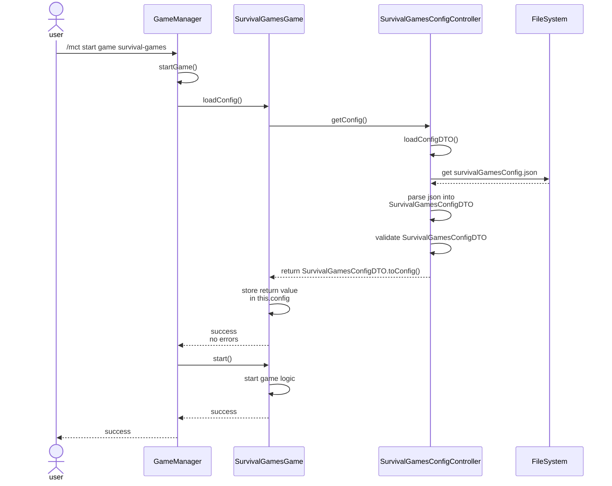

# Configuration

Commonly referred to throughout this documentation as "config", configuration refers to files which contain information that allow you to configure different aspects of MCTManager. 

Configurable aspects include locations, areas, times, scores, and items used in various games, contexts, and more. 

