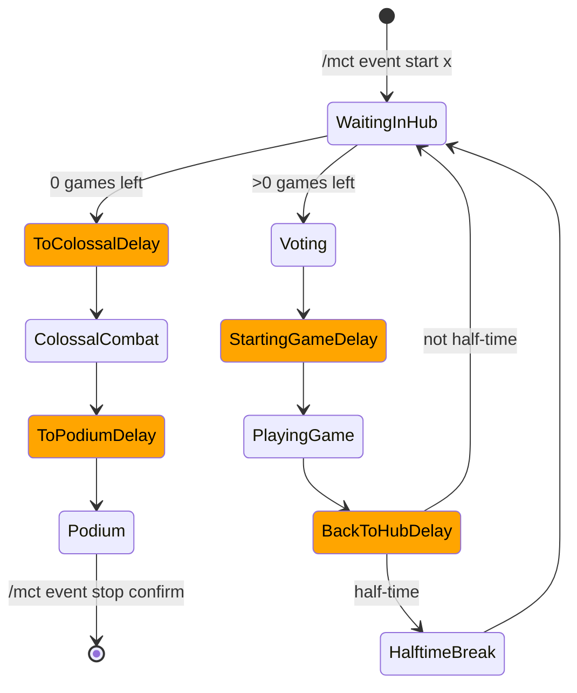

# Events

Events are a fundamental aspect of the MCTManager. An event is an auto-orchestrated series of games which ends in a final duel between the top two teams. 

## Event Flow

## Final Duel

The final duel is a battle between the first and second ranking players. 

