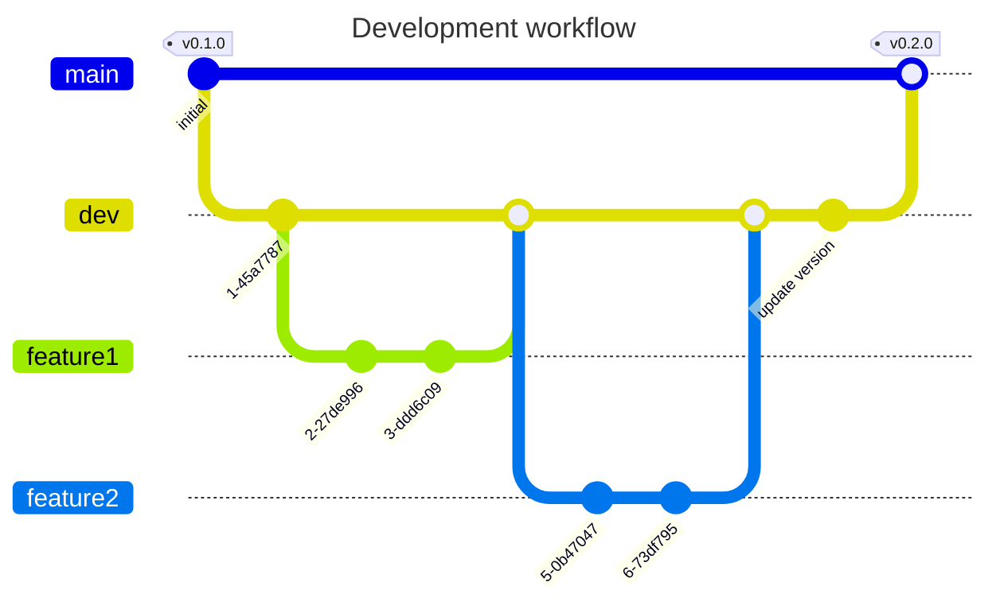

# Merging `dev` to `main`

To create an official public version of the plugin, you merge dev into main.

To merge dev into main:

- Open a pull request
    - Title: Merge dev to main for `vX.Y.Z`
    - Description: optionally summarize changes
- Review the files changed, and have someone else do the same to approve the PR
- Make sure the merge is not squashed. You need the individual commits on dev because each was a feature's PR.
- Perform the merge.
- Go to the [releases](https://github.com/Braekpo1nt/MCTManager/releases) page and draft a new release
- Choose a new tag and call it `vX.Y.Z` (whatever your version was)
- The release title should be the same as the tag
- Click **Generate Release Notes** to neatly put all the dev commits (which were feature PRs) into a list of what's changed since the last release
- Add the `.jar` binary to the release
    - Check out `main` locally and run a `./gradlew clean build` to create the jar to upload under `root/build/libs/MCTManager-X.Y.Z.jar`
- Publish the release
- Make sure all feature branches get the latest version of `dev` to prevent excessive merge conflicts
